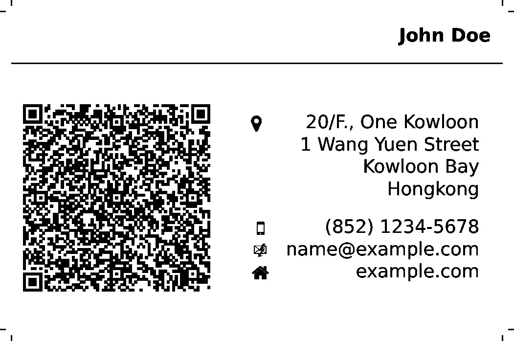
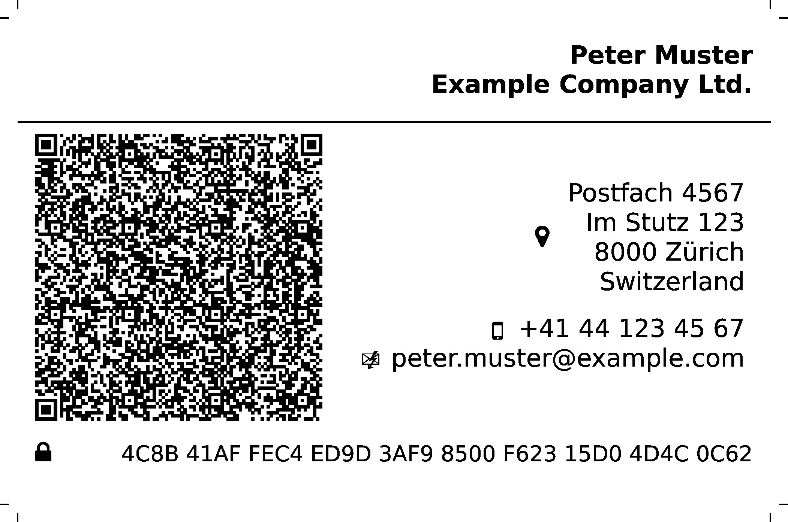
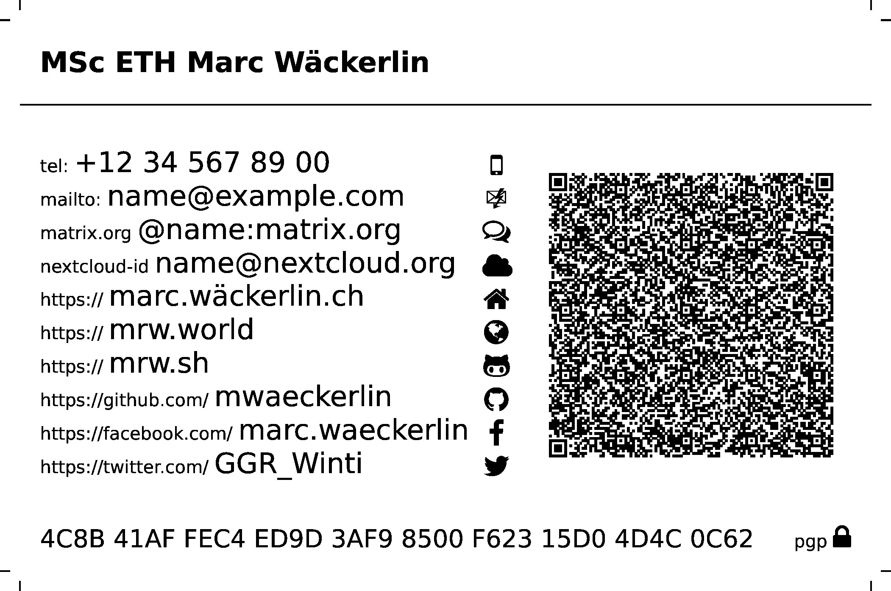
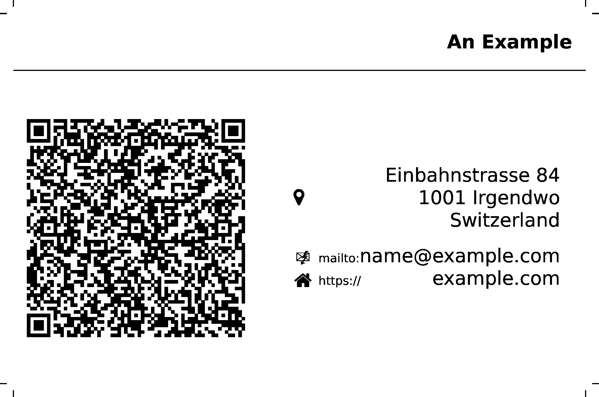

Businesscard with QR-Code
=========================

What happens, if you give someone a visiting card? Either he manually types the text into the mobilefone, or it will end up in a box and be forgotten. Here is the solution: A visiting card with QR-Code, so that it can be scanned with an [app] on the mobilefone and therefore automatically imported into the electronic contacts. This also works well, when yoiu are offline and bluetooth transfer fails. So here os the highly configurable businescard or visitingcards with full VCARD as QR-Code, ready to send to online printers.

Other available visitingcard templates, such as [mschlenker] distribute the cards on a A4 paper. But if you want a profesional printer, such as [onlineprinters], then you need to be able to generate a PDF with exactly one card, an exactly defined border and crop marks. That's why I wrote this template.

[](examples/john-doe-hongkong.tex)
[](examples/peter-muster-example-company-zuerich.tex)
[](examples/example.tex)


Features
--------

- all information is in the QR-Code
- full privacy: input is optional, specify only what you need, you decide what information to share
- optional icons, optional small hint texts
- several alignents
- freely size of paper and content
- supports honoric titles, full names, address woth post office box and extended information
- supports telefone, email, [jabber] and [matrix] chat
- supports several urls for your hompages
- supports [gitea], [github], [git]
- supports [facebook], [twitter], [google+], [youtube], [wikipedia]
- supports [pgp] key url and fingerprint
- supports [nextcloud federation id]


Usage Example
-------------

*Important*: You must use `xelatex` for compilation, because `xelatex` properly supports UTF-8 (e.g. needed for german umlauts or chinese characters). The package `inputenc` messes up with package `qrcode`.

Include the documentclass, define your date and add the document part:

```latex
\documentclass{businesscard-qrcode}

\def\type{home}
\def\printaddress{}
\def\givennames{An}
\def\familynames{Example}
\def\street{Einbahnstrasse 84}
\def\city{Irgendwo}
\def\zip{1001}
\def\country{Switzerland}
\def\homepage{example.com}
\def\email{name@example.com}

\begin{document}
	\drawcard
\end{document}
```

Save it as file [texstudio_d30266.tex] and compile it to get [texstudio_d30266.pdf]:

    xelatex -synctex=1 -interaction=nonstopmode texstudio_d30266.tex

The result:\\


See [examples] for more examples.


Documentclass Options
---------------------

Layout options are set as options to the `\documentclass`, e.g.:

    \documentclass[textwidth=0.7,qrwidth=0.25,www,nofill,iconright,rightalign,hint,icon,textfirst]{businesscard-qrcode}

Available options:
- `paperwidth`: width of the physical paper where the card is printed on (incl. border), default: `89mm`
- `paperheight`: height of the physical paper where the card is printed on (incl. border), default: `59mm`
- `contentwidth`: width of the card's content without the border that is cut, default: `85mm`
- `contentheight`: height of the card's content without the border that is cut, default: `55mm`
- `fontsize`: any fontsize allowed in `extarticle`, that are `8pt`, `9pt`, `10pt`, `11pt`, `12pt`, `14pt`, `17pt` and `20pt`, default: `8pt`
- `padding`: padding within the card's content, default: `2mm`
- `cutdist`: distance in `mm` where the cut marks are set, default: `2`
- `cutlen`: length of the cut marks in `mm`, default: `1`
- `textwidth`: relative width of the text block `1` means full width, so `qrwidth` plus `textwidth` should be smaller than `1` the remainig space is left empty between the text and QR-Code, default: `0.55` (that's 55% of the available space)
- `qrwidth`: relative width of the QR-Code `1` means full width, so `qrwidth` plus `textwidth` should be smaller than `1` the remainig space is left empty between the text and QR-Code, default: `0.40` (that's 40% of the available space)
- `lang`: language of the wikipedia page, will be prepended before `wikipedia.org`, e.g. `de.wikipedia.org`, default: `de`
- `address`or `noaddress`: disable rendering of the address in text and QR-Code, default: address
- `hint` or `nohint`: show the little text hints, default: `hint`
- `icon` or `noicon`: show the icons, default: `icon`
- `rightalign` or `leftalign`: align text left or right, default: `rightalign`
- `iconleft` or `iconright`: show icon left or right of the text, default: `iconleft`
- `fill` or `nofill`: fill empty space between icon and text, default: `fill`
- `qrfirst` or `textfirst`: switch position of QR-Code and text block, default: `qrfirst`
- `https` or `www`: should links in the hints be prefixed with `https://` or `www.`, default: `https`

Your data is entered as definitions in the document, e.g.:

    \def\email{name@example.com}

Please note, that spaces must be escaped, otherwise they do not appear in the QR-Code. You may not escape the spaces in your phone number, if you want them in the text, but not in the QR-Code, e.g.:

    \def\givennames{Juan\ Pablo}
    \def\familynames{Martínez\ Escudero}
    \def\phone{+41 52 123 45 67}

Recognized definitions:
- `type`: either `home` or `work` for personal or business cards
- `givennames`: your first name and eventual middle names
- `familynames`: your family names
- `honoricprefix`: honorix name prefixes, e.g. academic titles
- `honoricsuffix`: honoric name suffixes
- `additionalnames`: additionl names — I use it for the company name in business cards
- `pobox`: post office box
- `extaddr`: address extension, e.g. name of a building or floor number
- `street`: street and number of the address
- `city`: name of the address location
- `region`: region of the address
- `zip`: zip code of the address
- `country`: full name of country of the address in the language of the card
- `phone`: your phone number, the phone is marked as mobile, so to be used for voice and text (SMS)
- `email`: your email address
- `jabber`: your [jabber] or xmpp chat address
- `matrixorg`: your [matrix] chat addres, hint: use [riot] messenger for [matrix]
- `cloud`: your [nextcloud federation id] — the url is prepended automatically
- `homepage`: url to a web site with «home» icon — without `https://` not `www` (unless it is required), this is prepended automatically
- `world`: url to a web site with «world» icon — without `https://` not `www` (unless it is required), this is prepended automatically
- `link`: url to a web site with «link» icon — without `https://` not `www` (unless it is required), this is prepended automatically
- `wordpress`: url to a web site with «wordpress» icon — without `https://` not `www` (unless it is required), this is prepended automatically
- `drupal`: url to a web site with «» icon — without `https://` not `www` (unless it is required), this is prepended automatically
- `joomla`: url to a web site with «joomla» icon — without `https://` not `www` (unless it is required), this is prepended automatically
- `wikipedia`: if you or your company have a [wikipedia] entry, specify documentclass option `lang` for the language of you entry and use this definition for the name of your page — the url is prepended automatically
- `git`: the url of your [git] repository — without `https://` not `www` (unless it is required), this is prepended automatically
- `gitea`: the url of your [gitea] project page, you can use this tag also for other project management sites, such as [gogs] — without `https://` not `www` (unless it is required), this is prepended automatically
- `github`: your account name on [github] — only the name of the account, the url is prepended automatically
- `facebook`: your account name on [facebook] or the name of your page — only the name of the account or page, the url is prepended automatically
- `twitter`: your account name on [twitter] — only the name of the account, the url is prepended automatically
- `youtube`: your account name on [youtube] — only the name of the account, the url is prepended automatically
- `google`: your account name on [google+] — only the name of the account, the url is prepended automatically
- `pgpurl`: the full url to your pgp public key (only added to the QR-Code, not shown in the text)
- `pgpfingerprint`: the fingerprint of your pgp public key


Need More
---------

If you are missing a feature or a configuration option, just open a [ticket] and I will care about it.

[ticket]: https://mrw.sh/templates/latex/issues "open issues and tickets for my LaTeX-templates project"
[example]: examples "more examples"
[app]: https://f-droid.org/de/packages/com.google.zxing.client.android/ "Barcode Scanner"
[onlineprinters]: https://de.onlineprinters.ch/k/standardvisitenkarten "onlineprinters.ch"
[mschlenker]: https://gist.github.com/mschlenker/f60e0f15ff1edfc4881c "visitenkarten-qr.tex"
[texstudio_d30266.tex]: examples/texstudio_d30266.tex "simple example source file"
[texstudio_d30266.pdf]: examples/texstudio_d30266.pdf "simple example resulting pdf"
[example.tex]: examples/example.tex "larger example source file"
[example.pdf]: examples/example.pdf "larger example resulting pdf"
[jabber]: https://en.wikipedia.org/wiki/Jabber.org "the Jabber / XMPP instant messaging standard"
[matrix]: https://matrix.org "the matrix instant messaging standard"
[riot]: https://riot.im "matrix compatible instant messaging tool for all platforms"
[gitea]: https://gitea.io "github-like project repository, a gogs clone"
[gogs]: https://gitea.io "github-like project repository"
[github]: https://github.com "a project repository"
[git]: https://git-scm.com "a distributed version control system"
[facebook]: https://facebook.com "a social website"
[twitter]: https://twitter.com "a social website"
[google+]: https://plus.google.com "a social website"
[youtube]: https://youtube.com "a video website"
[wikipedia]: https://wikipedia.org "the online encyclopedia"
[pgp]: https://en.wikipedia.org/wiki/Pretty_Good_Privacy "pretty good privacy — encryption standard"
[nextcloud federation id]: https://nextcloud.com/federation "share your cloud across others"
